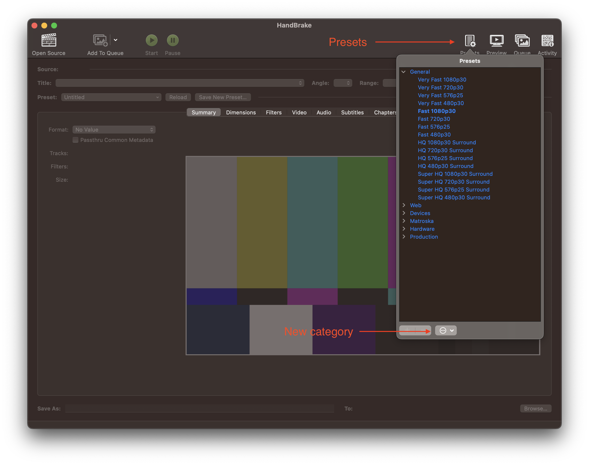
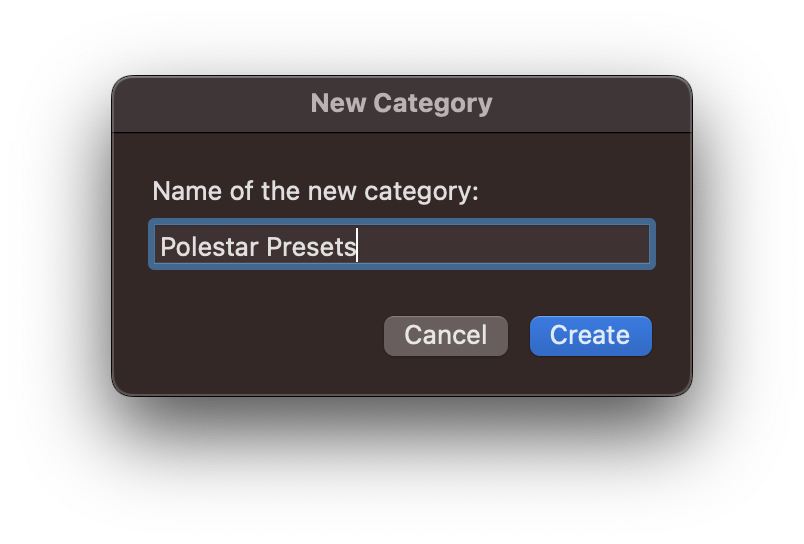
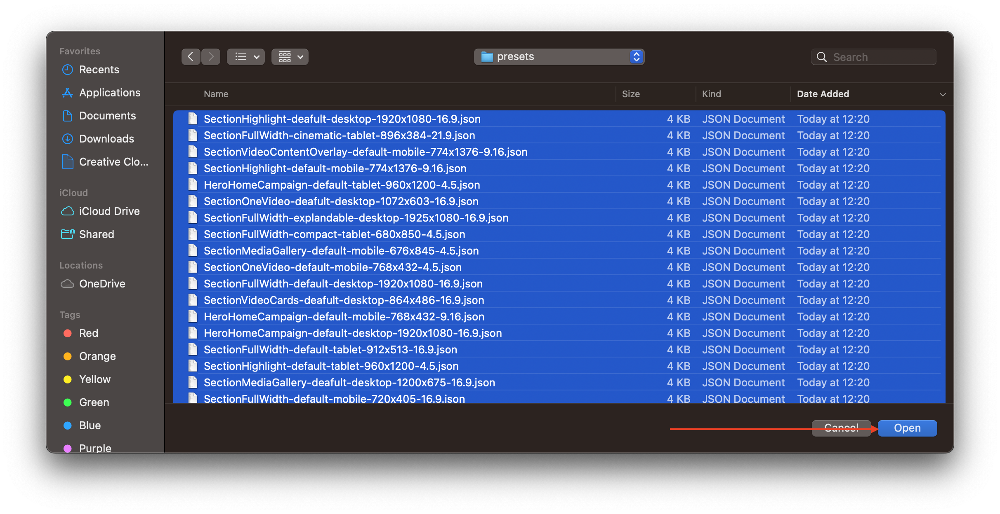
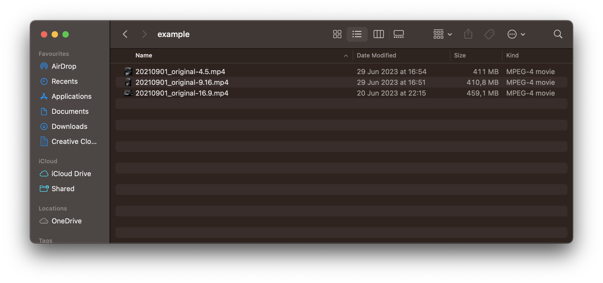
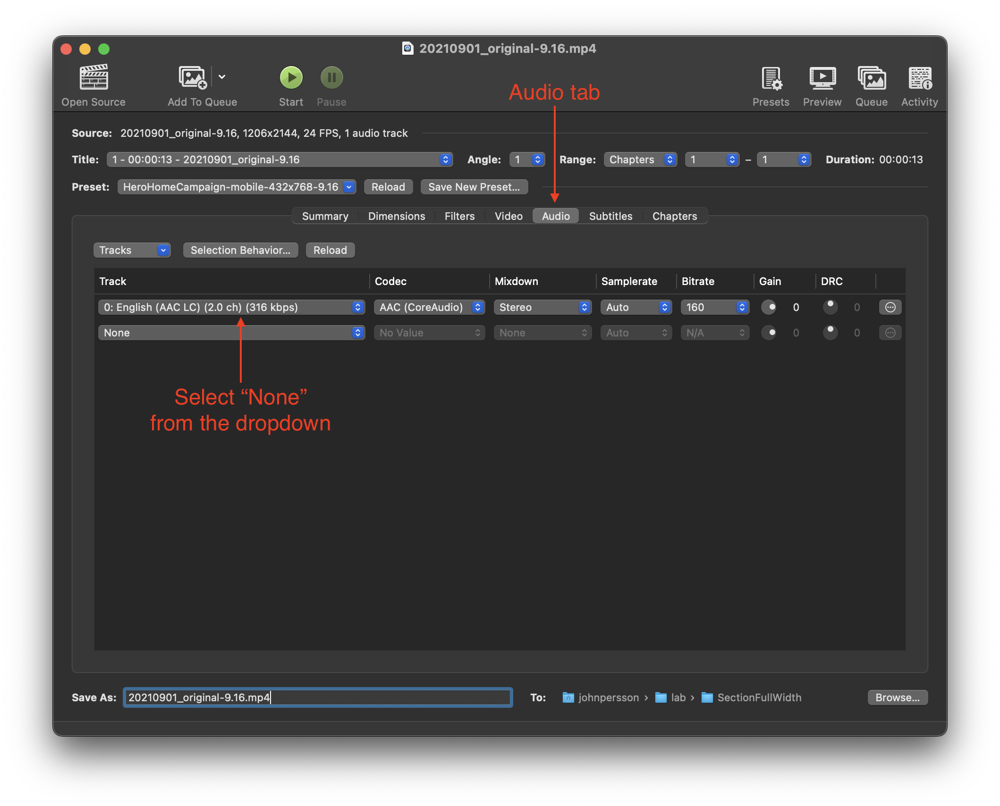
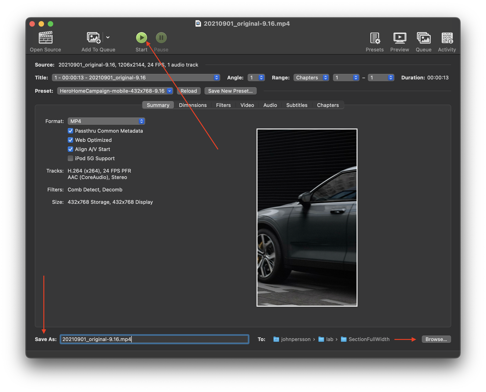

> ---
> ## ⬇️ Download
>
> The latest version of all available presets can be [downloaded here](../../../presets/presets-1.0.0.zip).
> ---

# Guide to Video Compression Using Presets

This guide provides instructions for video compression using Handbrake presets. Presets allow you to optimize source videos for the web while following our specifications and guidelines.

## Understanding Presets

Presets are based on detailed specifications found in the documentation for each video in this repository (for example [this one](../../domains/dotcom/sections/HeroHomeCampaign/)). They help to ensure proper video scaling, file format (mp4), codec (H.264), and include additional settings for optimal online streaming. The default frames per second (fps) is set to 24.

You can customize these settings on a case-by-case basis when necessary.

## Limitations of Presets

**Presets do not** automatically crop videos to match a specific aspect ratio. It is essential to have source videos in the correct aspect ratio and the highest possible image quality. Video cropping should be handled by a video editor and not as part of the compression process, as Handbrake is not designed for this purpose.

Currently, presets do not include the removal of audio. If a video's specifications require audio removal, additional steps need to be taken (explained in the [using presets](#using-the-presets) section).

---

## Downloading and Importing Presets

1. Start by downloading the presets from [this link](../../../presets/presets-1.0.0.zip).

   This will download a zip file containing all available presets. Unzip the file and open Handbrake.

2. In Handbrake, click the "Presets" icon in the top right corner. At the bottom of the newly opened window, click the icon with three dots to access the options menu and select "New Category".

   

   Name the category "Polestar Presets".

   

3. Next, open the presets options menu again and select "Import...".

   

4. Navigate to the folder where you downloaded the presets. Select all the files in the folder and click "Open".

   All presets should now be available under the "Polestar Presets" category.

---

## Using the Presets

To demonstrate the process, let's consider the [Hero Home Campaign](../../domains/dotcom/sections/HeroHomeCampaign/) section as an example. The specifications table indicates that we need source videos with the aspect ratios of 16:9 (Desktop), 4:5 (Tablet), and 9:16 (Mobile).

The image below displays a folder containing three source videos that we will compress using the presets from the previous section.

The videos' file sizes indicate good quality, which is desirable for starting with the best possible source material.

Additionally, the resolution of these files is higher than the target resolution defined by our presets, which helps maintain image quality.

1. Open Handbrake and compress a video for the Mobile video format mentioned in the specifications table.

2. From the specifications table, identify the video with the aspect ratio of 9:16. In this case, select the file named `20210901_original-9.16.mp4` (the "9.16" in the file name indicates a 9:16 aspect ratio) and drag it into Handbrake.

   

3. In the preview window within Handbrake, you will notice that the video appears stretched. To fix this, select the appropriate preset from our presets.

   Click the "Preset" dropdown, enter "Polestar Presets," and choose `HeroHomeCampaign-default-mobile-768x432-9.16`.

   > The preset naming convention follows this structure:
   >
   > `{$name}-{$variant}-{$device}-{$resolution}-{$aspectRatio}`
   >
   > For example, `HeroHomeCampaign-default-mobile-768x432-9.16`:
   >
   > - `HeroHomeCampaign`: the component's name
   > - `default`: the variant's name
   > - `mobile`: the target device
   > - `768x432`: the video resolution
   > - `9.16`: the video aspect ratio (in this case, 9:16)

   

4. Assuming the aspect ratio of the source video is correct, and you have selected the appropriate preset, the video preview window should now display the expected aspect ratio (without stretching).

   Since the specifications for the "Hero Home Campaign" state that there should be no audio, we need to remove the audio track. To do this, navigate to the audio tab, and select "None" from the audio track dropdown.

   

5. Enter a name next to "Save as," choose a folder to save the video to by clicking the "Browse" button, and start the compression process by clicking the button with the play icon.

   

Repeat these steps for the other formats mentioned in the specifications table (Desktop and Tablet) to complete the video delivery process.
